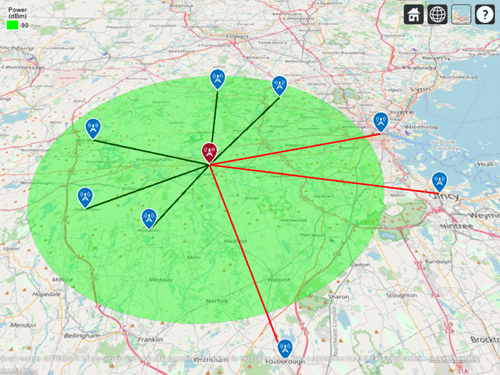

### Before Starting

1. Confirm that all communication applications and tools are turned off, closed, put away
1. Clone this repo and remove the origin remote `git remote rm origin`.
   - Commit after each function completion
   - **Do not** push your work at any time during this assessment.
   - **Do Not commit the `submit.sh` script if you accidentally make changes to it**
1. When the assessment is completed, contact your instructor to receive the submission instructions

#### Requirements

1. Pseudocode everything!
2. Define your "IOCE"
   - Input(s)
   - Output
   - Constraints
   - Edge Cases
3. Do not alter any existing function or variable definitions
4. Make sure to recognize and understand your constraints.
   - A "correct" answer that does NOT follow the constraints is a wrong answer.
   - It is better to have attempted to solve the problem the correct way, than to submit with a complete solution that does not follow the directions
5. Remember to use the console and reference the tests for guidance
6. Reach out for help and ask questions when needed
7. Pass all of the tests

#### Instructions

**1. Recursion**

- Find all keys of a provided name in an Object (and nested Objects) and rename them to a provided new name while preserving the value stored at that key.

Example:

```javascript
const obj = {
  golf: {
    zebra: "charlie",
  },
};

replaceKeysInObj(obj, "zebra", "delta");

// returns { golf: { delta: 'charlie' } };
```

**2. Executing Higher Order Functions**

VerCoxCast has created a super WiFi signal that broadcasts up to **55** km away. Create a call-list of customers who are within range so they can be notified. You are given an Array of `customers` with properties describing their location, name, and phone number.



Using higher-order functions and the given `calcDist` function,

- Create an Array of customers Objects who are within **55** km of the `antennaLocation`
- Each Object should have `dist`, `tel`, `fullName` properties
- Your result should look similar to this:

```js
[
  {
    dist: "13km",
    tel: "243-334-3008",
    name: "Kayes",
  },
  {
    dist: "53km",
    tel: "788-299-1863",
    name: "Goodban",
  },
];
```

**Note:** `calcDist`takes two location points and returns the distance in kilometers between them. Each point should an Object: { lat: <number>, log: <number> }. You don't need to understand how the function works. Just call it correctly with the correct arguments.

```javascript
const point1 = {
  lat: 42.9990723,
  lon: -85.99268728,
};
const point1 = {
  lat: 42.9791395,
  lon: -85.37634166,
};
calcDist(point1, point2); // 50.18071001957407 // Distance in km
```

Implement a solution in two ways:

1. Using the native methods of both `filter` and `map`
2. Using the native method of `reduce`
